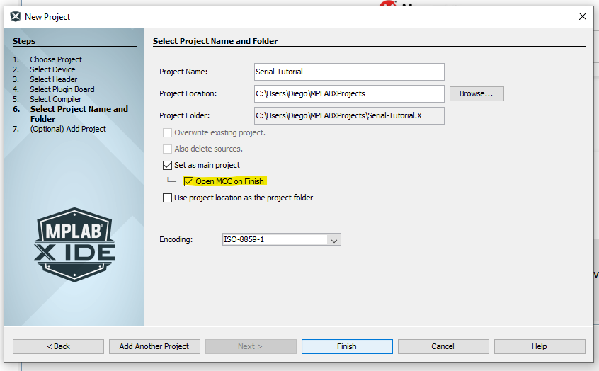
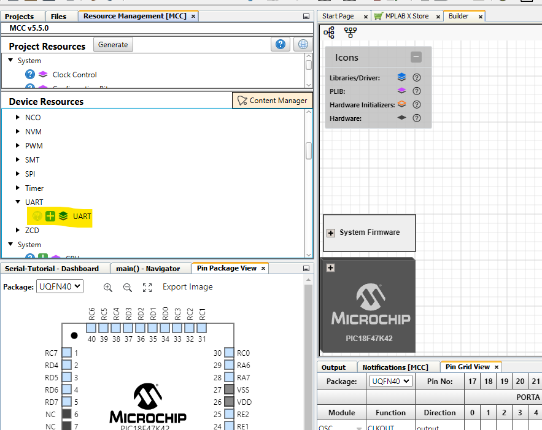
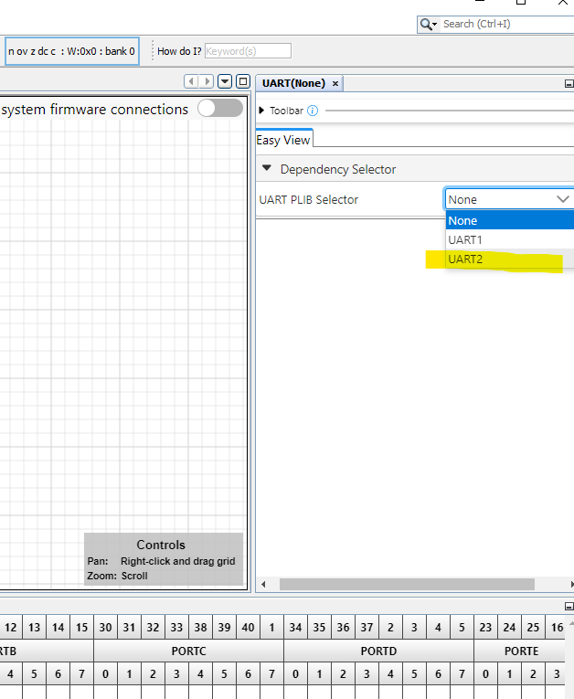
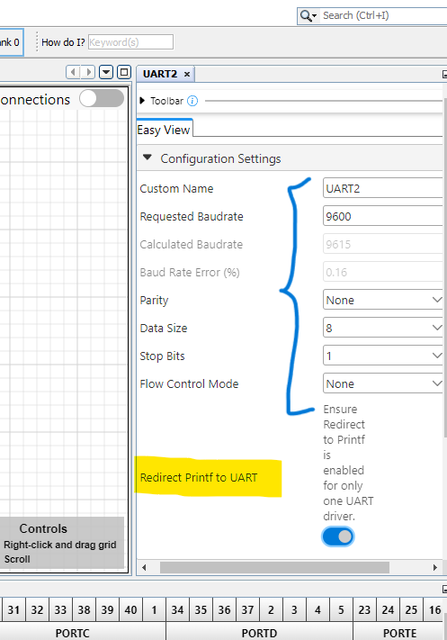
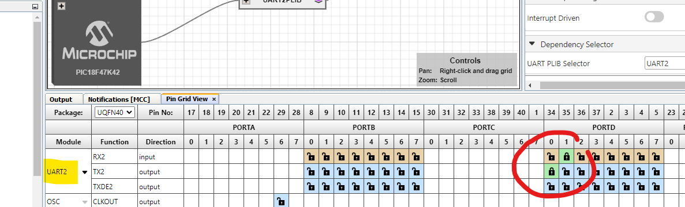
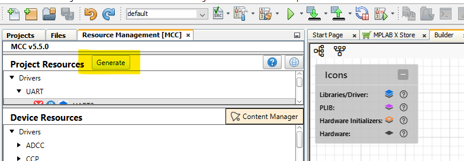
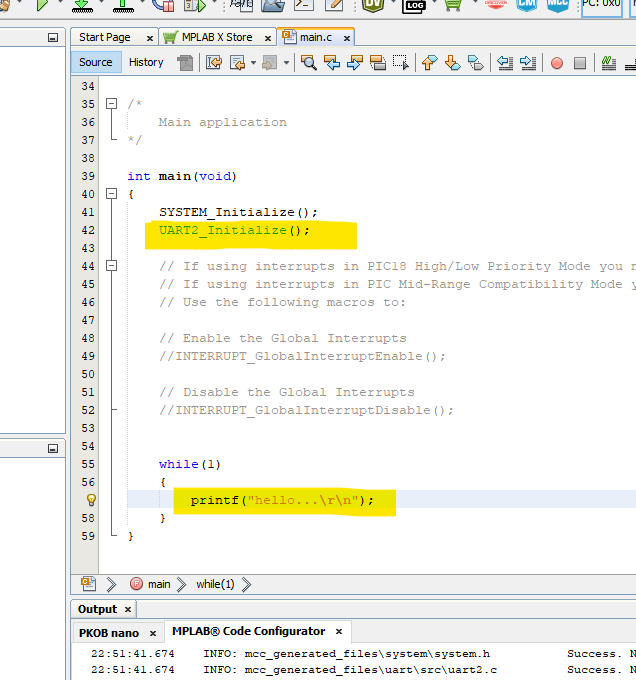
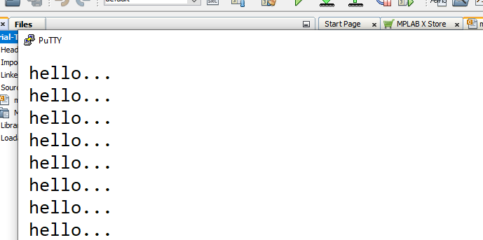

https://youtu.be/vfWQTlpFnVw

# Step 1. Create a Project w/ MCC
Create a new XC8 project for the Curiosity Nano, ensuring "open MCC when finished" is checked. Allow MCC to open, and click through any notifications.

# Step 2. Add the UART Module
Under 'Device Resources' in the 'Resource Management' window there is a UART driver module, click the green plus sign to add it to the builder.

# Step 3. Specify the Peripheral Library
A UART window should come up with a 'Dependency Selector' option. Select the UART2 peripheral library to add it to the pin grid.

# Step 4. Redirect Printf to UART
In the same UART window, after selecting the peripheral library, there should be some configuration settings. Ensure the 'Redirect Printf to UART' option is enabled.

# Step 5. Setup UART Pins using Pin Grid View
The 'Pin Grid View' window should reflect the new UART2 module which was just added. To pick up UART communications through the debugger, the UART RX and TX connections must be configured as: RX2 (input) on RD1 and TX2 (output) on RD0.

# Step 6. Generate
That should be all the configuration needed. Click 'Generate' in the 'Resource Management' window and close MCC when it finishes generating the project files.

# Step 7. Initialize the new Module
Navigate to main.c in the newly generated project files and add the line `UART2_Initialize();` within the main function. Now, once programmed, the board will write any printf commands to the COM port of your computer.

# Step 8. Monitoring the COM ports
Using PuTTY or another serial console program you can now receive communications from a programmed board.

