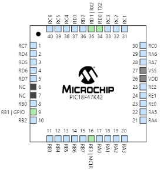

# Introduction to MPLAB MCC 
When starting a new project using PIC16, PIC24, or PIC32 microcontrollers, the setup of the configuration and all the peripherals can be time-consuming, especially for new projects. The MPLAB® Code Configurator (MCC) is an automatically installed plugin for MPLAB X IDE that simplifies this down to a series of simple selections from the menus within the MCC. The MCC generates driver code using a Graphical User Interface (GUI). The generated drivers control the peripherals on PIC® microcontrollers. The GUI provides an easy means for setting up the configuration of the peripherals.

Additionally, the MCC is used to configure and generate libraries, which allows you to configure and generate code for software libraries and off-chip peripherals. The generated drivers or libraries can be used in any PIC device application program.When starting a new project using PIC16, PIC24, or PIC32 microcontrollers, the setup of the configuration and all the peripherals can be time-consuming, especially for new projects. The MPLAB® Code Configurator (MCC) is an automatically installed plugin for MPLAB X IDE that simplifies this down to a series of simple selections from the menus within the MCC. The MCC generates driver code using a Graphical User Interface (GUI). The generated drivers control the peripherals on PIC® microcontrollers. The GUI provides an easy means for setting up the configuration of the peripherals. You can learn more here: https://developerhelp.microchip.com/xwiki/bin/view/software-tools/mcc/ 

In this tutorial we demosntrate how to use MCC to configure the USART module. Watch this Tutorial Video first: 
https://youtu.be/vfWQTlpFnVw . 
Many thanks to Mr. Diego King for creating this tutorial and tutorial video. 

# Step 1. Create a Project w/ MCC
Create a new XC8 project for the Curiosity Nano, ensuring "open MCC when finished" is checked. Allow MCC to open, and click through any notifications.


# Step 2. Add the UART Module
Under 'Device Resources' in the 'Resource Management' window there is a UART driver module, click the green plus sign to add it to the builder.


# Step 3. Specify the Peripheral Library
A UART window should come up with a 'Dependency Selector' option. Select the UART2 peripheral library to add it to the pin grid.


# Step 4. Redirect Printf to UART
In the same UART window, after selecting the peripheral library, there should be some configuration settings. Ensure the 'Redirect Printf to UART' option is enabled. In the figure below note that we are using Baudrate of 9600, Parity = NONE, Data Size = 8. Stop Bit = 1, and Control Mode = NONE. 


# Step 5. Setup UART Pins using Pin Grid View
The 'Pin Grid View' window should reflect the new UART2 module which was just added. To pick up UART communications through the debugger, the UART RX and TX connections must be configured as: RX2 (input) on RD1 and TX2 (output) on RD0.


# Step 5B. Related Registers
In the Build view of the MCC click on UART2PLIB block. Then click on Register Initialization tab. Review the register values. 


# Step 6. Generate
That should be all the configuration needed. Click 'Generate' in the 'Resource Management' window and close MCC when it finishes generating the project files.


After generating the code, a number of new functions and classes are generated. You can see a list of all these functional and classes under the tab called Classes.  


# Step 7. Initialize the new Module
Navigate to main.c in the newly generated project files and add the line `UART2_Initialize();` within the main function. Now, once programmed, the board will write any printf commands to the COM port of your computer.


# Step 8. Monitoring the COM ports
Using PuTTY or another serial console program you can now receive communications from a programmed board. If you don't have PuTTY download Tera Term. [Download Tera Term from here:](https://en.softonic.com/download/tera-term/windows/post-download). It is Also possible to use online serial terminals such as  https://serial.huhn.me/. See Appendix A for more information. 


# Step 9. Configuring IO Ports
It is very simple to configure a GPIO port as an input or output using MCC. Simply, open the MCC. Click on the GPIO and configure it as input or output. In this case we are configuring RB1 as an output. Note that everytime we make a change to the MCC we need to click on GENERATE button next to the Project Resources to update the MCC code. 


 Note that as you configure different GPIO ports the pins are updated on the chip: 

  

# Step 10. Changing the MAIN.C
We can now go back to the main.c program and add a little more code. The figure below shows the modified main.c. Note that we are using RB1 as an output and added a new RANDOM Function generator. 
 
  

 # Step 11. The New Output
Once again, let's check the new output using the Serial Terminal. We can also look at the output of the RB1 using a scope. 

  

  # Step 12. Interfacing with Matlab
Assuming you can send out numbers from your PIC to the terminal, it is easy to use MATLAB and plot, save, filter, or manipulate the received numbers using MATLAB. 
The main step is to enable your COM port using the following MATLAB command: 

```
s = serialport("COM3",9600,"Timeout",5);
data = read(s,16,"uint32");
```
Here is a very good example of a [dashboard using Matlab:](https://www.mathworks.com/help/matlab/import_export/create-an-app-to-connect-to-a-serial-port-gps-device-to-display-and-log-output.html). See [Ref 3] for more information.  

 # Assignment
Develop a code that generates a random number between 1-100 every one second write the value on the serial port. Then, using a serial terminal plot the values. Take a snapshot of your results and submit to Canvas. You need to have at least 30 points. 

 # Graduate Students Only
Graduate students must complete this section, as well. 
Using MCC modify the code so you can transmit and receive through the serial interface. Your code must be able to receive a character from the serial interface (for example A) to turn on an LED. If PIC receives a different character (say B) the LED should be turned off. You must demonstrate your project. 

# GitHub
Once you have completed the code and debugged it, submit the final code to your GitHub, in the Assignment folder. Make sure you name it properly. 

 # References
1. Refer to lecture slides for more information:
 https://docs.google.com/presentation/d/1JKKtNu3tkO9oB1XLOM3FUndg2SQ4MABi4Z2qnZM9kFc/edit?usp=sharing
2. Tutorial video by D. King: https://youtu.be/vfWQTlpFnVw
3. [Creating a serial data logger using Matlab:](https://billwaa.wordpress.com/2013/07/10/matlab-real-time-serial-data-logger/)

 # Appendix A - Serial Terminals
There are many different tools we can use to monitor the serial data. In some case we want to plot the data. A good program is the one that can easily be setup, you can send and receive characters easily, and plot the received data!
Here are some common tools

Here is a good list of available programs
* [An online serial monitor:](https://serial.huhn.me/)
* [Download Tera Term from here:](https://en.softonic.com/download/tera-term/windows/post-download).
* [Download Cool Term from here:](https://coolterm.en.lo4d.com/windows#google_vignette) - CoolTerm offers plotting option
* [An online serial plotter:](https://vaadin.com/labs/serial-api)
* Use Arduino Serial monitor (it has a plotter - must be downloaded)

   


